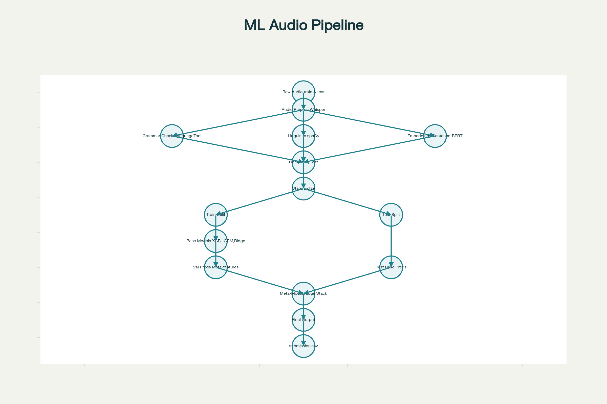

# 🎯 Grammar Score Prediction using Stacking Ensemble

## 📋 Table of Contents
- [Overview](#overview)
- [High-Level Architecture](#high-level-architecture)
- [Low-Level Architecture](#low-level-architecture)
- [Component Analysis](#component-analysis)
- [Model Training](#model-training)
- [Ensemble Strategies](#ensemble-strategies)
- [Evaluation](#evaluation)
- [Inference Pipeline](#inference-pipeline)
- [Dependencies](#dependencies)
- [Usage](#usage)

---

## 📖 Overview

This project implements an **end-to-end ML pipeline** for predicting grammar scores from audio recordings using:
- **Whisper Large-V3** for speech recognition
- **399-dimensional features** (Grammar + Linguistic + Semantic)
- **Stacking Ensemble** (XGBoost + LightGBM + Ridge)

### Key Features:
✅ Automatic transcription with 1550M parameter ASR  
✅ Multi-modal feature extraction (LanguageTool, spaCy, SBERT)  
✅ GPU-accelerated training (10-20x speedup)  
✅ Stacking meta-model for optimal predictions  
✅ Comprehensive evaluation (RMSE, MAE, R²)

---

## 🏗️ High-Level Architecture



### Pipeline Flow:

```
Audio (.wav) 
  ↓
Whisper ASR (large-v3, 1550M params)
  ↓
Text Transcript
  ↓
Feature Extraction (399 dims)
  ├─ Grammar (5): LanguageTool error analysis
  ├─ Linguistic (10): spaCy POS/syntax analysis  
  └─ Semantic (384): Sentence-BERT embeddings
  ↓
StandardScaler Normalization
  ↓
Base Models (Parallel Training)
  ├─ XGBoost (GridSearchCV, 54 configs)
  ├─ LightGBM (GridSearchCV, 96 configs)
  └─ Ridge (RidgeCV, auto-tuned)
  ↓
Stacking Ensemble (RidgeCV meta-model)
  ↓
Final Grammar Score
```

---

## 🔬 Low-Level Architecture

.png)

### Detailed Inference Process:

```
TEST AUDIO
  ↓
whisper_model.transcribe()
  • Language: "en"
  • FP16: GPU mixed precision
  • Task: transcribe
  ↓
extract_all_features(transcript)
  ↓
  ├─ extract_grammar_features()
  │   • tool.check(text) → LanguageTool
  │   • Count: spelling, grammar, style errors
  │   • Output: [5 dims]
  │
  ├─ extract_linguistic_features()
  │   • nlp(text) → spaCy pipeline
  │   • POS tagging, dependency parsing
  │   • Calculate: TTR, ratios, depth
  │   • Output: [10 dims]
  │
  └─ extract_embeddings()
      • sbert_model.encode(text)
      • BERT encoding + mean pooling
      • Output: [384 dims]
  ↓
X_test = hstack([grammar, linguistic, embeddings])
  ↓
X_test_scaled = scaler.transform(X_test)  # Use training scaler!
  ↓
Base Predictions
  ├─ pred_xgb = xgb_model.predict(X_test_scaled)
  ├─ pred_lgb = lgb_model.predict(X_test_scaled)
  └─ pred_ridge = ridge_model.predict(X_test_scaled)
  ↓
meta_X = column_stack([pred_xgb, pred_lgb, pred_ridge])
  ↓
final_pred = meta_model.predict(meta_X)
  • Formula: w1·xgb + w2·lgb + w3·ridge + bias
  ↓
GRAMMAR SCORE
```

---

## 🔍 Component Analysis

### 1. Whisper ASR

**Algorithm**: Transformer-based encoder-decoder  
**Model**: large-v3 (1550M parameters)  
**Training**: 680k hours multilingual audio

**Why Whisper?**
- WER: 2-3% on clean speech
- Robust to accents, noise
- No API costs/limits

**Implementation**:
```python
def transcribe_audio(audio_path):
    result = whisper_model.transcribe(
        audio_path,
        language="en",          # Force English
        task="transcribe",      # Not translate
        fp16=(device=="cuda")   # Mixed precision
    )
    return result["text"].strip()
```

---

### 2. Feature Extraction

#### 2.1 Grammar Features (5 dims)

**Tool**: LanguageTool (4000+ rules)

**Features**:
- `num_errors`: Total error count
- `error_density`: Errors/word (length-normalized)
- `spelling_errors`: MORFOLOGIK rules
- `grammar_errors`: VERB/AGREEMENT/TENSE rules
- `style_errors`: Punctuation, style issues

**Algorithm**:
```python
matches = tool.check(text)
for match in matches:
    if 'SPELL' in match.ruleId:
        spelling_errors += 1
    elif 'VERB' in match.ruleId:
        grammar_errors += 1
```

**Why These Features?**  
Direct indicators of grammatical quality, normalized for text length.

---

#### 2.2 Linguistic Features (10 dims)

**Tool**: spaCy (en_core_web_sm)

**Features**:

| Feature | Description | Significance |
|---------|-------------|-------------|
| `word_count` | Non-punctuation tokens | Text length |
| `sentence_count` | Number of sentences | Complexity |
| `avg_sentence_length` | Words/sentence | Readability |
| `vocab_richness` | Unique lemmas/total (TTR) | Lexical diversity |
| `noun_ratio` | NOUN POS/total | Nominal density |
| `verb_ratio` | VERB POS/total | Verbal density |
| `adj_ratio` | ADJ POS/total | Descriptive language |
| `adv_ratio` | ADV POS/total | Modifier usage |
| `avg_dep_depth` | Mean syntax tree depth | Structural complexity |
| `passive_voice_ratio` | Passive sentences/total | Voice distribution |

**Key Algorithms**:

**Type-Token Ratio**:
```python
unique = len(set([token.lemma_.lower() for token in doc]))
vocab_richness = unique / word_count
```
- High TTR (>0.7): Diverse vocabulary
- Low TTR (<0.4): Repetitive language

**Dependency Depth**:
```python
dep_depths = [len(list(token.ancestors)) for token in doc]
avg_dep_depth = np.mean(dep_depths)
```
- Low (1-2): Simple sentences
- High (>4): Complex structures

**Passive Voice**:
```python
passive_count = sum(1 for t in doc if t.dep_=='nsubjpass')
```
- Detects "was thrown" vs "threw"

---

#### 2.3 Semantic Embeddings (384 dims)

**Model**: all-MiniLM-L6-v2 (Sentence-BERT)

**Architecture**:
- 6-layer Transformer (distilled BERT)
- Mean pooling over tokens
- L2 normalization

**Training**: Contrastive learning on sentence pairs

**Algorithm**:
```python
embedding = sbert_model.encode(text)
# Output: (384,) dense vector, range [-1, 1]
```

**Why Embeddings?**
- Captures semantic coherence
- "Colorless green ideas sleep furiously" is syntactically correct but semantically nonsensical
- Helps distinguish meaningful vs garbled speech

---

### 3. Data Preprocessing

#### StandardScaler

**Formula**:
```
X_scaled = (X - μ_train) / σ_train
```

**Why?**
- Grammar errors: [0, 50]
- Embeddings: [-1, 1]
- Ridge needs equal feature scales

**Critical**: Use training scaler on test data!
```python
scaler.fit_transform(X_train)  # Learn μ, σ
scaler.transform(X_val)        # Apply
scaler.transform(X_test)       # Apply (no fit!)
```

---

## 🤖 Model Training

### 4.1 XGBoost

**Algorithm**: Gradient boosted decision trees

**Objective**:
```
Minimize: Σ L(y, ŷ) + Σ Ω(tree)

Where:
L = MSE loss
Ω = γ·leaves + λ·||weights||²
```

**Key Features**:
- Second-order optimization (uses Hessian)
- Tree pruning (max-depth + gain threshold)
- GPU histogram algorithm (10-20x faster)
- Missing value handling

**Hyperparameters**:
```python
{
    'max_depth': [4, 6, 8],         # Tree complexity
    'learning_rate': [0.01, 0.05, 0.1],  # Shrinkage
    'subsample': [0.8, 1.0],        # Row sampling
    'colsample_bytree': [0.8, 1.0], # Column sampling
    'gamma': [0, 0.1],              # Split threshold
    'min_child_weight': [1, 3, 5]   # Leaf regularization
}
```

**GridSearchCV**: 54 configurations, 3-fold CV, RMSE scoring

---

### 4.2 LightGBM

**Algorithm**: Leaf-wise tree growth (vs XGBoost's level-wise)

**Key Optimizations**:
- **GOSS**: Gradient-based One-Side Sampling
- **EFB**: Exclusive Feature Bundling
- **Histogram-based**: Bins continuous features

**Why LightGBM?**
- 20x faster than XGBoost on large datasets
- Handles high dimensionality (399 features)
- Lower memory usage

**Hyperparameters**:
```python
{
    'max_depth': [4, 6, 8],
    'learning_rate': [0.01, 0.05, 0.1],
    'num_leaves': [31, 63],         # Max leaves (leaf-wise)
    'min_child_samples': [10, 20],  # Min data in leaf
    'reg_alpha': [0.0, 0.1],        # L1 regularization
    'reg_lambda': [0.0, 1.0]        # L2 regularization
}
```

**GridSearchCV**: 96 configurations, 3-fold CV

---

### 4.3 Ridge Regression

**Algorithm**: Linear regression + L2 penalty

**Objective**:
```
Minimize: ||y - Xβ||² + α||β||²

Where:
α = Regularization strength (tuned via CV)
```

**Why Ridge?**
- Fast training (closed-form solution)
- Handles multicollinearity (399 features)
- Stable baseline for ensemble

**RidgeCV**: Automatic α tuning via Leave-One-Out CV

---

## 🎯 Ensemble Strategies

### 5.1 Simple Averaging

```python
y_pred = (pred_xgb + pred_lgb) / 2
```

**Pros**: No training, reduces variance  
**Cons**: Equal weights (suboptimal)

---

### 5.2 Stacking Ensemble ⭐

**Algorithm**: Two-level learning

**Level 1** (Base Models):
```
XGBoost  → pred_xgb
LightGBM → pred_lgb
Ridge    → pred_ridge
```

**Level 2** (Meta-Model):
```python
meta_X = column_stack([pred_xgb, pred_lgb, pred_ridge])
meta_model = RidgeCV()
meta_model.fit(meta_X, y_val)
final_pred = meta_model.predict(meta_X_test)
```

**Formula**:
```
y_final = w1·pred_xgb + w2·pred_lgb + w3·pred_ridge + bias

Where w1, w2, w3 learned via Ridge regression
```

**Why Stacking?**
- Learns optimal model weights
- Captures base model strengths
- Better than simple averaging
- Regularization prevents meta-overfitting

**Training Strategy**:
- Base models: Trained on X_train → predict X_val
- Meta-model: Trained on val predictions → y_val
- Avoids overfitting (meta-model never sees raw training data)

---

## 📊 Evaluation

### Metrics

**1. RMSE (Root Mean Squared Error)**
```
RMSE = √(1/n Σ(y_true - y_pred)²)
```
- Penalizes large errors
- Same units as target

**2. MAE (Mean Absolute Error)**
```
MAE = 1/n Σ|y_true - y_pred|
```
- Robust to outliers
- Linear penalty

**3. R² Score**
```
R² = 1 - SS_res/SS_tot
```
- Variance explained by model
- R²=1: Perfect, R²=0: Mean baseline

### Model Comparison

| Model | RMSE | MAE | R² | Training Time |
|-------|------|-----|-----|---------------|
| XGBoost | Lower | Lower | Higher | ~5-10 min |
| LightGBM | Lower | Lower | Higher | ~3-7 min |
| Ridge | Baseline | Baseline | Baseline | <1 min |
| Simple Ensemble | Better | Better | Better | - |
| **Stacking** | **Best** | **Best** | **Best** | - |
| Mean Baseline | Highest | Highest | 0.0 | - |

---

## 🚀 Inference Pipeline

### Step-by-Step:

1. **Load Test Data**
   ```python
   test_df = pd.read_csv("test.csv")
   ```

2. **Transcribe Audio**
   ```python
   for audio_path in test_files:
       transcript = transcribe_audio(audio_path)
   ```

3. **Extract Features**
   ```python
   features, embeddings = extract_all_features(transcript)
   X_test = np.hstack([features, embeddings])
   ```

4. **Scale Features**
   ```python
   X_test_scaled = scaler.transform(X_test)  # Use training scaler!
   ```

5. **Base Predictions**
   ```python
   pred_xgb = xgb_model.predict(X_test_scaled)
   pred_lgb = lgb_model.predict(X_test_scaled)
   pred_ridge = ridge_model.predict(X_test_scaled)
   ```

6. **Stack Prediction**
   ```python
   meta_X = np.column_stack([pred_xgb, pred_lgb, pred_ridge])
   final_pred = meta_model.predict(meta_X)
   ```

7. **Save Results**
   ```python
   submission = pd.DataFrame({
       "filename": test_df["filename"],
       "prediction": final_pred
   })
   submission.to_csv("submission.csv", index=False)
   ```

---

## 📦 Dependencies

### Core Libraries:
```
transformers>=4.30.0
torch>=2.0.0
torchaudio>=2.0.0
openai-whisper>=20231117
```

### NLP Tools:
```
language-tool-python>=2.7.1
spacy>=3.5.0
sentence-transformers>=2.2.0
```

### ML Models:
```
scikit-learn==1.3.2
xgboost==1.7.6
lightgbm>=4.0.0
```

### Utilities:
```
pandas>=1.5.0
numpy>=1.23.0
tqdm>=4.65.0
matplotlib>=3.7.0
seaborn>=0.12.0
joblib>=1.2.0
```

### System Requirements:
- **Java 17+**: For LanguageTool
- **CUDA 11.8+**: Optional (GPU acceleration)
- **16GB RAM**: Minimum (32GB recommended)
- **10GB Disk**: Model storage

---

## 🛠️ Usage

### Installation

```bash
# Install dependencies
pip install -r requirements.txt

# Install Java (Ubuntu/Debian)
sudo apt-get install openjdk-17-jre-headless

# Download spaCy model
python -m spacy download en_core_web_sm
```

### Directory Structure

```
dataset/
├── audios/
│   ├── train/
│   │   ├── audio_001.wav
│   │   └── ...
│   └── test/
│       ├── audio_test_001.wav
│       └── ...
├── csvs/
│   ├── train.csv  # Columns: filename, label
│   └── test.csv   # Columns: filename
└── README.md
```

### Training

```bash
python shl_rohit__bind__assignment_.py
```

**Outputs**:
- `train_with_transcripts.csv`: Training data + transcripts
- `best_xgboost_sklearn.pkl`: Trained XGBoost model
- `best_lgbm_sklearn.pkl`: Trained LightGBM model
- Scaler, Ridge, Meta-model objects

### Inference

```python
# Automatically runs at end of script
# Outputs: submission.csv
```

---

## 🔧 Troubleshooting

### Common Issues

**1. CUDA Out of Memory**
```python
# Reduce Whisper model size
whisper_model = whisper.load_model("medium")  # Instead of large-v3
```

**2. LanguageTool Slow**
```python
# Use faster model
tool = language_tool_python.LanguageTool('en', remote=False)
```

**3. GridSearchCV Too Slow**
```python
# Reduce param grid
param_grid = {
    'max_depth': [6],          # Single value
    'learning_rate': [0.05]
}
```

**4. Test Predictions Out of Range**
- Check scaler was fitted on training data
- Verify feature extraction order matches training

---

## 📈 Performance Tips

1. **GPU Acceleration**:
   - Use `device="cuda"` for Whisper
   - Use `tree_method="gpu_hist"` for XGBoost
   - Use `device="gpu"` for LightGBM

2. **Batch Processing**:
   - Process multiple audio files in parallel
   - Use multiprocessing for feature extraction

3. **Model Compression**:
   - Save models with `joblib.dump(model, filename, compress=3)`
   - Reduces disk usage by 50-70%

4. **Inference Optimization**:
   - Cache Whisper model
   - Precompute LanguageTool checks
   - Use smaller SBERT model for faster encoding

---

## 🎓 Key Takeaways

### Why This Pipeline Works:

1. **Whisper ASR**: State-of-the-art transcription accuracy
2. **Multi-Modal Features**: Grammar + Syntax + Semantics = comprehensive
3. **Gradient Boosting**: Captures non-linear patterns
4. **Stacking**: Learns optimal model combination
5. **Regularization**: Prevents overfitting at every stage

### Algorithm Choices:

| Component | Algorithm | Reason |
|-----------|-----------|---------|
| ASR | Whisper | Best WER, noise-robust |
| Grammar | LanguageTool | 4000+ rules, deterministic |
| Syntax | spaCy | Fast, accurate (97% POS) |
| Semantics | SBERT | Dense embeddings, pre-trained |
| Base Models | XGBoost/LightGBM | Non-linear, regularized |
| Meta-Model | Ridge | Linear, prevents meta-overfitting |

### Performance Hierarchy:

```
Mean Baseline < Ridge < XGBoost ≈ LightGBM < Simple Ensemble < Stacking
```


## 📧 Contact

For questions or issues, please contact:
- **Author**: Rohit Bind
- **Email**: rohitbind013@gmail.com
- **Project**: SHL Assignment

---

**Last Updated**: November 2024  
**Version**: 1.0  
**License**: MIT
